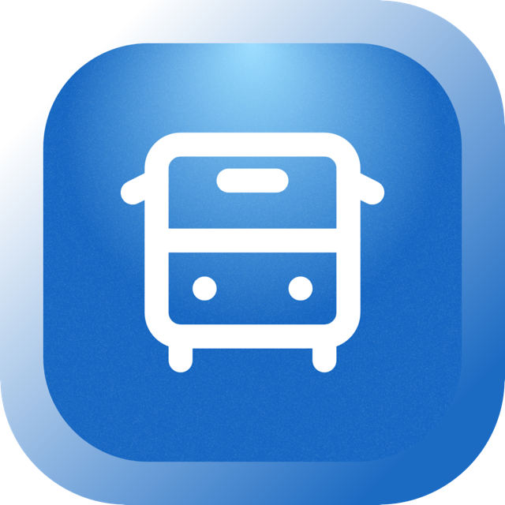

# TRIP Dashboard - Project Overview

  
  <h2>Transit Routing & Integrated Payments</h2>

## 📋 About TRIP

TRIP Dashboard is a comprehensive fleet management system designed for bus operators in Cebu, Philippines. It provides a unified platform for managing bus operations, tracking revenue, and monitoring fleet performance through encrypted, tamper-proof data collection.

**Mission**: Modernize public transportation management by providing bus companies with a digital, data-driven platform that enhances operational efficiency, prevents fare evasion, and delivers actionable insights through comprehensive analytics.

## 🚌 The Transit Node (Product 1)

Transform every bus into a smart terminal. The Transit Node is deployed on each bus, creating a seamless digital experience for passengers and conductors.

### Features

- **QR Code Payments**: Instant cashless payments via QR codes. Passengers scan, pay, and board in seconds.
- **One-Tap Stop Requests**: Passengers request stops with a single tap. No more shouting or missed stops.
- **Conductor Interface**: Simple interface for conductors to upload trip data. Secure, encrypted submission after each trip.

### Passenger Experience

Board the bus, scan the QR code at your seat, pay with your preferred method, and request your stop—all from your phone or the in-bus terminal.

- 💳 Multiple Payment Options (Cash, QR codes, digital wallets)
- 🎯 Never Miss a Stop

## 🏢 The Fleet Command (Product 2)

Your operational command center. Analyze performance and make informed decisions with comprehensive trip data collected after each journey.

### Features

- **Data Encryption & Security**: End-to-end encryption prevents data tampering. Conductors and passengers cannot modify trip data, eliminating fare evasion.
- **Post-Trip Analytics**: Trip data syncs to the dashboard after each journey. Analyze revenue per route, per bus, and identify trends.
- **Revenue Tracking**: Comprehensive financial reports updated after each trip. Track earnings, payment methods, and passenger categories.

### What We Track

From a single screen, analyze trip data, monitor revenue trends, and track fleet performance:

- 📊 Trip Analytics
- 🔒 Encrypted Data
- 📈 Revenue Reports

## 🔄 How It Works

### The Problem (Old Way)

- ❌ **Manual Processes**: Paper tickets and manual counting waste time and resources
- ❌ **Cash-Only Payments**: Limited payment options reduce passenger convenience
- ❌ **Limited Visibility**: Operators struggle to track fleet performance and revenue accurately
- ❌ **Fare Evasion**: Manual systems allow data manipulation and revenue loss

### Our Solution (Digital & Data-Driven)

- ✅ **Digital Automation**: Paperless transactions with instant data synchronization
- ✅ **Multiple Payment Options**: Cash, QR codes, and digital wallets for maximum flexibility
- ✅ **Post-Trip Analytics**: Comprehensive dashboard with trip data synced after each journey
- ✅ **Tamper-Proof Security**: Encrypted data prevents manipulation and eliminates fare evasion

## 🎯 Dashboard Features

### For Bus Operators

- **Overview Dashboard**: Visualization of revenue, ridership, and fleet statistics
- **Financial Reports**: Revenue analytics with payment method breakdown and passenger category tracking
- **Operations Management**: Complete CRUD operations for buses, drivers, and conductors
- **Route Analytics**: Post-trip performance analysis for each route including revenue per passenger metrics

### For Conductors

- **Trip Upload**: Secure, encrypted upload of trip data via .enc files
- **Assignment Tracking**: View assigned bus, driver, and route information
- **Data Validation**: Preview trip details before submission with comprehensive ticket breakdown

## 🔒 Security & Data Integrity

- **End-to-End Encryption**: All trip data is encrypted to prevent tampering
- **Tamper-Proof System**: Conductors and passengers cannot modify submitted trip data
- **Fare Evasion Prevention**: Encrypted data ensures accurate revenue reporting
- **Post-Trip Sync**: Data is synced to the central database after each trip completion

## 🎨 Design Philosophy

- **Minimal & Clean**: Simple, intuitive interfaces that don't overwhelm users
- **Responsive Design**: Fully functional on desktop, tablet, and mobile devices
- **Modern & Professional**: TRIP Blue (#186cc7) color scheme with Poppins font family
- **Consistent**: Shadcn/ui components for accessible, cohesive design

## 📞 Contact

For commercial licensing or inquiries:

- Email: epanto.gg@gmail.com
- GitHub: [TRIP Dashboard Repository](https://github.com/gian-gg/TRIP-dashboard)

## 📄 License

This project is **open-source** but **not free for commercial use**.

- ✅ **Allowed**: View, modify, and use for **non-commercial** projects
- ❌ **Prohibited**: Selling, redistributing, or monetizing without permission

---

_Last Updated: December 2, 2025_
